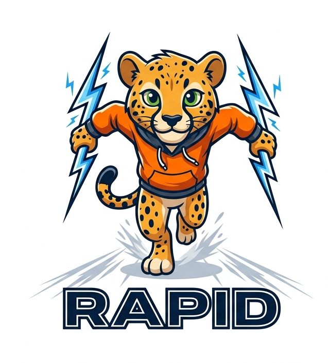
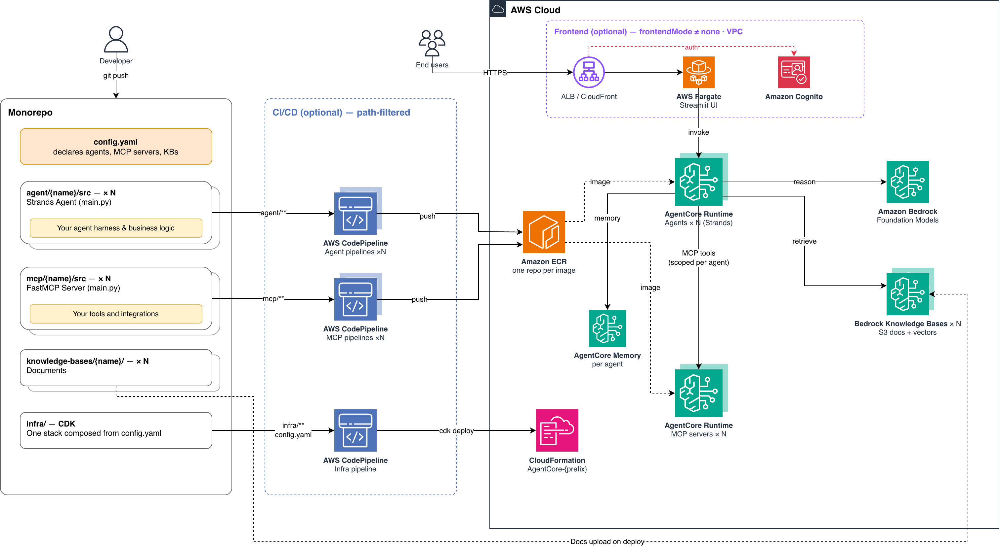

<div align="center">

</div>

# RAPID — Rapid Agent Prototyping & Infrastructure Deployment

RAPID is a config-driven monorepo blueprint for standing up agentic AI solutions on [Amazon Bedrock AgentCore](https://docs.aws.amazon.com/bedrock-agentcore/latest/devguide/what-is-bedrock-agentcore.html). You describe your agents, MCP tool servers, and knowledge bases in one `config.yaml`, run one deploy, and get a wired stack you can start customizing immediately. It is built for developers who want a working agent in an AWS account today and would rather spend their time on agent behaviour than on infrastructure plumbing.

> **Sample code.** This repository is intended for demonstration and prototyping. Review and adapt it to your own security, reliability, and compliance requirements before any production use.

## What you get

| Capability | What it does |
|---|---|
| **Multi-agent runtime** | Multiple containerized [Strands](https://strandsagents.com/) agents on [AgentCore Runtime](https://docs.aws.amazon.com/bedrock-agentcore/latest/devguide/runtime.html), each with its own model, tools, and configuration |
| **Persistent memory** | Cross-session [AgentCore Memory](https://docs.aws.amazon.com/bedrock-agentcore/latest/devguide/memory.html) per agent, so conversations carry context |
| **RAG / knowledge bases** | Drop documents in a directory; deploy creates an [Amazon Bedrock Knowledge Base](https://docs.aws.amazon.com/bedrock/latest/userguide/knowledge-base.html) and ingests them. Re-ingest later with `make ingest-kb` |
| **MCP tool servers** | An extensible tool layer over the [Model Context Protocol](https://modelcontextprotocol.io/), where a tool is a Python function |
| **Web frontend** | Optional Streamlit chat UI on [AWS Fargate](https://docs.aws.amazon.com/AmazonECS/latest/developerguide/AWS_Fargate.html) with [Amazon Cognito](https://docs.aws.amazon.com/cognito/latest/developerguide/what-is-amazon-cognito.html) auth, behind an [Application Load Balancer](https://docs.aws.amazon.com/elasticloadbalancing/latest/application/introduction.html) or [Amazon CloudFront](https://docs.aws.amazon.com/AmazonCloudFront/latest/DeveloperGuide/Introduction.html). Off by default; `make ui` runs it locally instead |
| **CI/CD pipelines** | Opt-in via `make enable-cicd` — path-based [AWS CodePipeline](https://docs.aws.amazon.com/codepipeline/latest/userguide/welcome.html) triggers rebuild and redeploy only the agent or MCP server you changed |
| **Reusable CDK constructs** | Every piece — agent runtime, knowledge base, MCP server, auth, frontend, pipelines — is an independent L3 construct you can compose or replace |

## Quickstart

Five commands from a clean clone. The shipped `config.yaml` works unmodified, so **no tracked file needs editing** to get to a running agent. `make help` lists every target.

1. Check prerequisites — AWS credentials, Docker, Node.js, Python toolchain, `jq`, Bedrock model access in the target region, and CDK bootstrap state:

   ```bash
   make doctor
   ```

2. [Bootstrap](https://docs.aws.amazon.com/cdk/v2/guide/bootstrapping.html) CDK, once per account and region:

   ```bash
   cd infra && npx cdk bootstrap && cd ..
   ```

3. Deploy the stack. This builds ARM64 container images locally and provisions everything in `config.yaml` (`make install` runs first to fetch the CDK dependencies):

   ```bash
   make deploy
   ```

4. Talk to the deployed agent:

   ```bash
   make chat
   ```

5. Tear it all down when you are finished:

   ```bash
   make destroy
   ```

Anything unexpected along the way is covered in [`docs/troubleshooting.md`](docs/troubleshooting.md), which also lists the log source for each failure mode — or run `make logs` to tail the agent runtime.

For the guided version, with customization and a first tool of your own, follow [GETTING_STARTED.md](GETTING_STARTED.md).

## Architecture



The diagram follows the flow from left to right:

- **Monorepo.** `config.yaml` declares the agents, MCP servers, and knowledge bases; each has a matching directory holding your code — the agent harness and business logic under `agent/{name}/src`, tools and integrations under `mcp/{name}/src`, documents under `knowledge-bases/{name}/`. The CDK app under `infra/` composes one stack from that declaration.
- **CI/CD (optional, path-filtered).** With `make enable-cicd`, a push triggers only the pipelines whose paths changed: one CodePipeline per agent, one per MCP server, and an infra pipeline that runs `cdk deploy`. Without it, `make deploy` does the same from your machine.
- **AWS Cloud.** Container images land in ECR, one repository per image. Each agent runs as a Strands agent on its own AgentCore Runtime, reasoning with Bedrock foundation models, keeping cross-session context in its own AgentCore Memory, retrieving from its Bedrock Knowledge Base, and calling MCP tools served by separate AgentCore Runtimes — scoped per agent. The wiring between them is injected as environment variables at deploy time.
- **Frontend (optional).** When `frontendMode` is not `none`, end users reach a Streamlit UI on Fargate through an ALB or CloudFront, authenticated by Cognito. With the default `none`, nothing user-facing is deployed and `make chat` talks to the agent directly.

## Project structure

The agents, MCP server, and knowledge bases below are illustrative examples — rename or replace them with your own; `customer-support` is the fully-wired reference to copy.

```text
config.yaml            # The one file that defines what gets deployed
agent/                 # One directory per agent — this is what you customize
  customer-support/    #   Reference agent: tools, prompt, KB retrieval, MCP client, evals
  it-helpdesk/         #   Second agent: its own KB and tools, no evals suite
knowledge-bases/       # One directory per knowledge base; contents are ingested on deploy
mcp/                   # One directory per MCP server
  support-tools/       #   Reference FastMCP server with sample tools
frontend/              # Streamlit chat UI — run locally with `make ui`, or deploy it
infra/                 # AWS CDK application (TypeScript)
  lib/constructs/      #   Reusable L3 constructs — the building blocks
  lib/stacks/          #   Stack composition, driven entirely by config.yaml
  lambda/              #   Python sources for deploy-time custom resources
  test/                #   CDK unit and snapshot tests
docs/                  # Focused guides and the architecture diagram
scripts/               # Shell helpers that the Makefile targets invoke
```

## Making it yours

RAPID is a starting point, not a finished product — the expected next step is swapping the example agents, tools, and documents for your own. [GETTING_STARTED.md](GETTING_STARTED.md) walks through that: customizing the prompt and tools, adding an agent or an MCP server, and wiring in your documents.

The repository is also built with agentic development in mind. [AGENTS.md](AGENTS.md) is a steering file for coding agents — conventions, step-by-step workflows for adding or renaming components, and the verification commands to run. Point your coding assistant at it (most tools such as Kiro, Cursor, or Claude Code pick it up automatically) and prompts like "add a new agent that handles billing questions" land on the right files with the right checks.

## Configuration

Everything is driven by [`config.yaml`](config.yaml) at the repository root: the deployment prefix, the region, the default model, the frontend mode, and the lists of agents, MCP servers, and knowledge bases. Edit it and run `make deploy` — there are no context flags and no environment variables to set. The default model is `global.anthropic.claude-haiku-4-5-20251001-v1:0`.

Every key, its type, its default, and its effect: [`docs/configuration.md`](docs/configuration.md).

## Cost

The shipped default (`frontendMode: none`) provisions nothing that bills by the hour — you pay for what you invoke plus a small amount of storage. Deploying a frontend adds always-on resources. [`docs/cost-and-teardown.md`](docs/cost-and-teardown.md) covers what bills while idle, per mode, and what `make destroy` leaves behind.

## Documentation

| Guide | What it covers |
|---|---|
| [GETTING_STARTED.md](GETTING_STARTED.md) | Step-by-step walkthrough: deploy, talk to the agent, customize it |
| [`docs/configuration.md`](docs/configuration.md) | Every `config.yaml` key, its default, and its effect |
| [`docs/frontend.md`](docs/frontend.md) | What each `frontendMode` provisions and how it is authenticated |
| [`docs/cost-and-teardown.md`](docs/cost-and-teardown.md) | What bills while idle, and what `make destroy` leaves behind |
| [`docs/troubleshooting.md`](docs/troubleshooting.md) | Failure modes, the check for each, and the log source that explains it |
| [`infra/lib/constructs/README.md`](infra/lib/constructs/README.md) | The L3 constructs, and how to use them without the config wrapper |
| [AGENTS.md](AGENTS.md) | Repository conventions for automated coding agents |
| [CONTRIBUTING.md](CONTRIBUTING.md) | How to report an issue, open a pull request, and verify a change locally |
| [CHANGELOG.md](CHANGELOG.md) | Release history |

## Licence and attribution

Licensed under the Apache License, Version 2.0 — see [LICENSE](LICENSE) and [NOTICE](NOTICE). Copyright Amazon.com, Inc. or its affiliates.

Third-party dependency licences are not restated here; each subproject declares its own dependencies in its `pyproject.toml` (Python) or `package.json` (TypeScript), and those files are the authoritative record.

**Authors:** David Lichtenwalter, Marco Strauss.

Contributions are welcome under the terms in [CONTRIBUTING.md](CONTRIBUTING.md), and participation is governed by [CODE_OF_CONDUCT.md](CODE_OF_CONDUCT.md).
